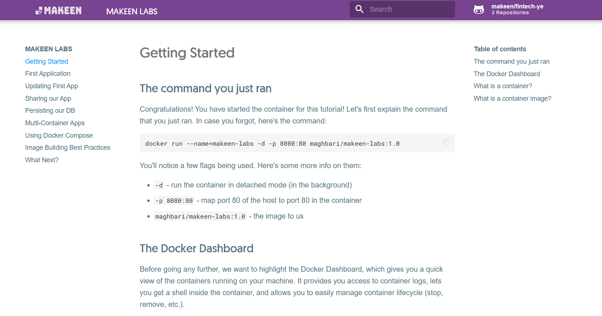

# Docker Getting Started Tutorial



This tutorial was written with the intent of helping Trainees get up and running
with containers and is designed to work with Docker Desktop. While not going too much 
into depth, it covers the following topics:

- Running your first container
- Building containers
- Learning what containers are
- Running and removing containers
- Using volumes to persist data
- Using bind mounts to support development
- Using container networking to support multi-container applications
- Using Docker Compose to simplify the definition and sharing of applications
- Using image layer caching to speed up builds and reduce push/pull size
- Using multi-stage builds to separate build-time and runtime dependencies

## Getting Started

The tutorial documentation is published on:
[https://fintech-ye.github.io/getting-started](https://fintech-ye.github.io/getting-started)

If you wish to run the tutorial locally, you can use the following command after installing Docker Desktop:

```bash
docker run --name=makeen-labs -d -p 8080:80 maghbari/makeen-labs:1.0
```

Once it has started, you can open your browser to [http://localhost:8080](http://localhost:8080).