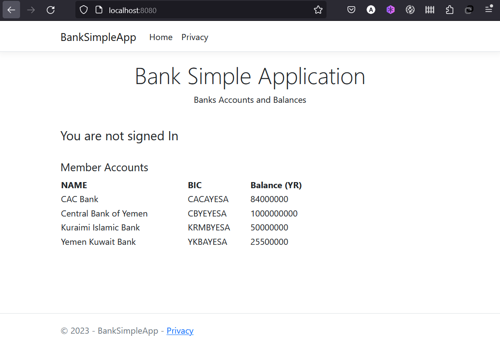

Up to this point, we have been working with single container apps. But, we now want to add MSSQL Server DB to the
application stack. The following question often arises - "Where will MSSQL Server run? Install it in the same
container or run it separately?" In general, **each container should do one thing and do it well.** A few
reasons:

- There's a good chance you'd have to scale APIs and front-ends differently than databases.
- Separate containers let you version and update versions in isolation.
- While you may use a container for the database locally, you may want to use a managed service
  for the database in production. You don't want to ship your database engine with your app then.
- Running multiple processes will require a process manager (the container only starts one process),
  which adds complexity to container startup/shutdown.

## Container Networking

Remember that containers, by default, run in isolation and don't know anything about other processes
or containers on the same machine. So, how do we allow one container to talk to another? The answer is
**networking**. Now, you don't have to be a network engineer. Simply remember this rule...

> If two containers are on the same network, they can talk to each other. If they aren't, they can't.


## Starting MSSQL Server

There are two ways to put a container on a network: 1) Assign it at start or 2) connect an existing container.
For now, we will create the network first and attach the MSSQL Server container at startup.

1. Create the network.

    ```bash
    docker network create bank-network
    ```

1. Pull the official MS SQLServer docker image from docker hub https://hub.docker.com/_/microsoft-mssql-server


    ```bash
    docker pull mcr.microsoft.com/mssql/server:2022-latest
    ```

1. Start a MSSQL Server container and attach it to the network. We're also going to define a few environment variables that the
  database will use to initialize the database (see the "Environment Variables" section in the [Microsoft Learn](https://learn.microsoft.com/en-us/sql/linux/quickstart-install-connect-docker?view=sql-server-ver16)).

  > Remeber: This tutorial uses a simple password `CBY@123456` as an example for this tutorial, your password will always be different

    ```bash
    docker run -d --network=bank-network --name mssql-server -p 1433:1433 -e "ACCEPT_EULA=Y" -e "MSSQL_SA_PASSWORD=CBY@123456" -e "MSSQL_PID=Evaluation"  -v mssql_volume:/var/opt/mssql -d mcr.microsoft.com/mssql/server:2022-latest
    ```

    !!! info "Pro-tip"
        You will notice we're using a volume named `mssql_volume` here and mounting it at `/var/opt/mssql`, which is
        where MSSQL Server stores its data. However, we never ran a `docker volume create` command. Docker recognizes we want
        to use a named volume and creates one automatically for us.

1. To confirm we have the database up and running, connect to the database and verify it connects.

    ```bash
    docker exec -it mssql-server  /opt/mssql-tools/bin/sqlcmd  -S localhost -U sa -P CBY@123456 -Q "sp_databases"
    ```

    You should see output that looks like this:

    ```plaintext
    +--------------------+--------------------+
    | DATABASE_NAME      | DATABASE_SIZE      |
    +--------------------+--------------------+
    | master             | 6848 NULL          |
    | model              | 16384 NULL         |
    | msdb               | 16960 NULL         |
    | tmpdb              | 73728 NULL         |
    +--------------------+--------------------+
    ```

## Creating Simple Data

Now that we know MSSQL Server is up and running, but before using it in our app, we need to create simple data in our database

1. Clone the BankSimpleApp Repository

    ```bash
    git clone https://github.com/fintech-ye/BankSimpleApp.git
    ```

    Now change the working directory into the repo directory by executing:

    ```bash
    cd BankSimpleApp
    ```

1. Execute the following `docker cp` command to copy `.sql` files into mssql-server docker container

    ```bash
    docker cp ./db_init/ mssql-server:/tmp/
    ```

    The above command will copy the directory `db_init` into the MSSQL Server container. The directory `db_init` contains 
    two files `db_create.sql` and `db_insert.sql`. The files content look like the following:

    ```sql
    IF NOT EXISTS (SELECT name FROM sys.databases WHERE name = 'cby')
    BEGIN
    CREATE DATABASE cby;
    END
    ```

    ```sql
    IF object_id('cby.dbo.#accounts') is not null
    BEGIN
        CREATE TABLE [cby].[dbo].[accounts] (
            [BIC]          VARCHAR (50) NOT NULL,
            [account_name] VARCHAR (50) NOT NULL,
            [balance]      INT          CONSTRAINT [DEFAULT_accounts_balance] DEFAULT ((0)) NOT NULL,
            [bank_code]    CHAR (10)    NULL,
            [currency]     CHAR (10)    CONSTRAINT [DEFAULT_accounts_currency] DEFAULT ((886)) NOT NULL,
            CONSTRAINT [PK_accounts] PRIMARY KEY CLUSTERED ([BIC] ASC)
        );
    END

    DELETE FROM cby.dbo.accounts;

    INSERT INTO cby.dbo.accounts (BIC, account_name, balance, bank_code, currency)
    VALUES ('CBYEYESA', 'Central Bank of Yemen', 1000000000, 'CBYE', '886'),
           ('KRMBYESA', 'Kuraimi Islamic Bank', 50000000, 'KRMB', '886'),
           ('YKBAYESA', 'Yemen Kuwait Bank', 25500000, 'YKBA', '886'),
           ('CACAYESA', 'CAC Bank', 84000000, 'CACB', '886');
    ```

1. Execute the following `docker exec` command, to create a new database called `cby` and a table called `accounts`, in
addition to inserting 4 records into the accounts table.

    ```bash
    docker exec -it mssql-server /opt/mssql-tools/bin/sqlcmd -S localhost -U sa -P CBY@123456 -i /tmp/db_init/db_create.sql -i /tmp/db_init/db_insert.sql
    ```
    
The command `docker exec` is used to execute a command inside a specific container. So in the previous command, we have run a utility tool called `sqlcmd` (which is inside the `mssql-server` container) to execute the `.sql` files we have previously copied to the container.

1. Ensure that our test data has been generated by executing:

    ```bash
    docker exec -it mssql-server /opt/mssql-tools/bin/sqlcmd -S localhost -U sa -P CBY@123456 -Q "select * from cby.dbo.accounts"
    ```
    You should see output that looks like this:

```bash
BIC                             account_name                               balance     bank_code  currency
------------------------------- ----------------------------------------- ----------- ---------- ----------
CACAYESA                        CAC Bank                                    84000000     CACB       886
CBYEYESA                        Central Bank of Yemen                       1000000000   CBYE       886
KRMBYESA                        Kuraimi Islamic Bank                        50000000     KRMB       886
YKBAYESA                        Yemen Kuwait Bank                           25500000     YKBA       886
```

Now our MSSQL Server container `mssql-server` is ready, let's use it! But, the question is... how? If we run
our app container on the same network, how our app will find the database container?

Simply, our app only needs to connect to the db using a host named `mssql-server` which as also the name of the MSSQL Server
container and it'll talk to the database!

See, It doesn't get much simpler than that!


## Running our BankSimpleApp with MSSQL Server

The BankSimpleApp app supports the setting of a few environment variables to specify MSSQL connection settings. They are:

- `DB_SERVER` - the hostname for the running MSSQL server
- `DB_UID` - the username to use for the connection
- `DB_PASSWD` - the password to use for the connection
- `DB_NAME` - the database to use once connected

!!! warning Setting Connection Settings via Env Vars
    While using env vars to set connection settings is generally ok for development, it is **HIGHLY DISCOURAGED**
    when running applications in production. A more secure mechanism is to use the secret support provided by a container orchestration framework, such as `Kubernetes`.

With all of that explained, let's start our dev-ready container!

1. Pull the docker image from docker hub https://hub.docker.com/r/maghbari/bank-simple-app

    ```bash
    docker pull maghbari/bank-simple-app
    ```

1. We'll specify each of the environment variables above, as well as connect the container to our app network.

    ```bash
    docker run -d --network=bank-network --name=bank-app -p 8080:80 -e DB_SERVER="mssql-server,1433" -e DB_NAME="cby" -e DB_UID="sa" -e DB_PASSWD="CBY@123456" maghbari/bank-simple-app
    ```

1. After a few seconds, open your web browser to [http://localhost:8080](http://localhost:8080).

    You should see our container app `bank-app` has queried and viewed bank accounts data from `mssql-server` container
    which is running on the same network `bank-network` with our app.

    {: style="width: 80%; " }
    {: .text-center }

If you take a quick look at the Docker Dashboard, you'll see that we have two app containers running. But, there's
no real indication that they are grouped together in a single app. We'll see how to make that better shortly!


## Recap

At this point, we have an application that now stores its data in an external database running in a separate
container. We learned a little bit about container networking and saw how service discovery can be performed
simply using containers names.

But, there's a good chance you are starting to feel a little overwhelmed with everything you need to do to start up
this application. We have to create a network, start containers, specify all of the environment variables, expose
ports, and more! That's a lot to remember and it's certainly making things harder to pass along to someone else.

In the next section, we'll talk about Docker Compose. With Docker Compose, we can share our application stacks in a
much easier way and let others spin them up with a single (and simple) command!