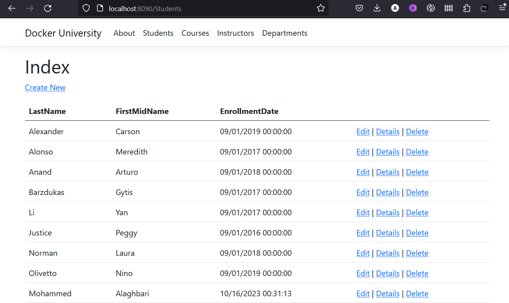
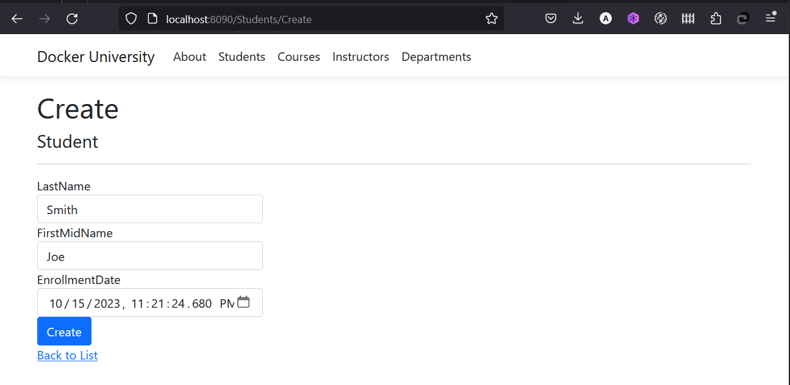

In case you didn't notice, our todo list is being wiped clean every single time
we launch the container. Why is this? Let's dive into how the container is working.

## The Container's Filesystem

When a container runs, it uses the various layers from an image for its filesystem.
Each container also gets its own "scratch space" to create/update/remove files. Any
changes won't be seen in another container, _even if_ they are using the same image.

### Seeing this in Practice

To see this in action, let's run the univerity application, an example dotnet core app the reads
data from a sqlite data. The app is a web site for a fictional Docker University that includes functionalities
such as student admission, course creation, and instructor assignments.

1. Pull the docker image from docker hub
https://hub.docker.com/r/maghbari/university-app

    ```bash
    docker pull maghbari/university-app
    ```
1. Start your container using the `docker run` command and specify the name of the image we 
    just pulled:

    ```bash
    docker run --name=university-app -d -p 8090:80 maghbari/university-app
    ```

1. After a few seconds, open your web browser to [http://localhost:8090](http://localhost:8090).
    You should see our app!

    {: style="width: 70%; " }
    {: .text-center }

1. Using the app UI, Go ahead to Students menu and add a student or two and see that it works as you expect.
   Refresh the page to ensure the frontend is successfully storing items in the backend.

    {: style="width: 79%; " }
    {: .text-center }

1. Now, let's remove the container 

    ```bash
    docker rm -f university-app
    ```
   execute `docker ps` to ensure the container is removed

1. Now, Start the container again using the same command you have previously used:

    ```bash
    docker run --name=university-app -d -p 8090:80 maghbari/university-app
    ```
    Go again to Students menu qnd look! The Student you have added are not there!
    That's because the data was written to the scratch space of the container.

## Container Volumes

With the previous experiment, we saw that each container starts from the image definition each time it starts. 
While containers can create, update, and delete files, those changes are lost when the container is removed 
and all changes are isolated to that container.

With `volumes`, we can change all of this.

[Volumes](https://docs.docker.com/storage/volumes/) provide the ability to connect specific filesystem paths of 
the container back to the host machine. If a directory in the container is mounted, changes in that
directory are also seen on the host machine. If we mount that same directory across container restarts, we'd see
the same data.

There are two main types of volumes. We will eventually use both, but we will start with **named volumes**.

## Persisting our Todo Data

By default, the [university app](https://github.com/fintech-ye/dotnet-example-app) stores its data in a SQLite Database at
`/db/CU.db`. If you're not familiar with SQLite, no worries! It's simply a relational database in 
which all of the data is stored in a single file.

With the database being a single file, if we can persist that file on the host and make it available to the
next container, it should be able to pick up where the last one left off. By creating a volume and attaching
(often called "mounting") it to the directory the data is stored in, we can persist the data. As our container 
writes to the `CU.db` file, it will be persisted to the host in the volume.

As mentioned, we are going to use a **named volume**. Think of a named volume as simply a bucket of data. 
Docker maintains the physical location on the disk and you only need to remember the name of the volume. 
Every time you use the volume, Docker will make sure the correct data is provided.

1. Create a volume by using the `docker volume create` command.

    ```bash
    docker volume create db_volume
    ```

1. Stop the univeristy app container once again in the Dashboard (or with `docker rm -f <container-id>`), as it is still running without using the persistent volume.

1. Start the univeristy app container, but add the `-v` flag to specify a volume mount. We will use the named volume and mount
   it to `/db`, which will capture all files created at the path.

    ```bash
    docker run -d --name university-app -p 8090:80 -v db_volume:/db/ university-app
    ```

1. Once the container starts up, open the app and add a few items through the students menu.

1. Remove the container for the university app. Use the Dashboard or `docker ps` to get the ID and then `docker rm -f <container-id>` to remove it.

1. Start a new container using the same command from above.

1. Open the app. You should see all students data still in your list!

1. Go ahead and remove the container when you're done checking out your list.

Now You've now learned how to persist data!

!!! info "Pro-tip"
    While named volumes and bind mounts (which we'll talk about in a minute) are the two main types of volumes supported
    by a default Docker engine installation, there are many volume driver plugins available to support NFS, SFTP, NetApp, 
    and more! This will be especially important once you start running containers on multiple hosts in a clustered
    environment with like Kubernetes.

## Diving into our Volume

A lot of people frequently ask "Where is Docker _actually_ storing my data when I use a named volume?" If you want to know, 
you can use the `docker volume inspect` command.

```bash
docker volume inspect todo-db
[
    {
        "CreatedAt": "2023-10-15T22:14:39Z",
        "Driver": "local",
        "Labels": null,
        "Mountpoint": "/var/lib/docker/volumes/db_volume/_data",
        "Name": "db_volume",
        "Options": null,
        "Scope": "local"
    }
]
```

The `Mountpoint` is the actual location on the disk where the data is stored. Note that on most machines, you will
need to have root access to access this directory from the host. But, that's where it is!

In the previous chapter, we talked about and used a **named volume** to persist the data in our database.
Named volumes are great if we simply want to store data, as we don't have to worry about _where_ the data
is stored.

## Using Bind Mounts

In the previous example, we used a named volume to persist the data in our database. Named volumes are great if we simply want to store data, as we don't have to worry about where the data is stored.

With **bind mounts**, we control the exact mountpoint on the host. We can use this to persist data, but is often
used to provide additional data into containers. Let's again work with the university application, but now
we will use a bind mount to
mount a host path in which the `CU.db` will be stored.

1. Stop the univeristy app container once again in the Dashboard (or with `docker rm -f <container-id>`).

1. Start the univeristy app container, but now the  `-v` flag will specify a binding mount on the host
   instead of using a named volume.

    ```bash
    docker run -d --name university-app -p 8090:80 -v c:/Users/MO/db/:/db/ university-app
    ```
    Note that the binding mount path `c:/Users/MO/db/` should be replaced by a path in your host machine.

1. Open the folder where the binding mount path located, and there you will find the database file `CU.db`

1. Once the container starts up, open the app and add a few items through the students menu.

1. Now try removing and running the container again using the last `docker run` command we have used
   You will find that all students data still in your list!


At this point, we have a functioning application that can survive restarts or damages!
