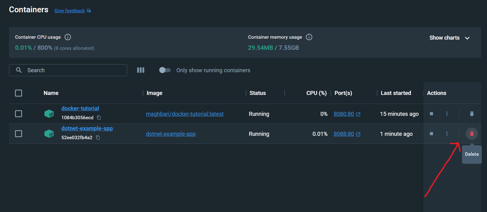
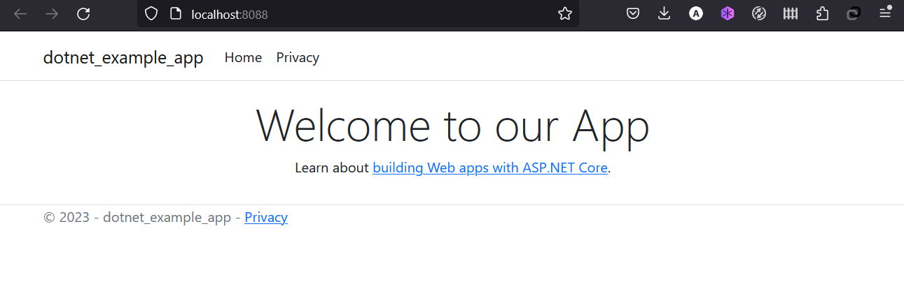

Now we've been asked by the product team to change the welcome message in our app `dotnet-example-app`
into `Welcome to our App`

## Updating our Source Code

1. In the `Pages/Index.cshtml` file, update line 8 to use the new empty text.

    ```diff
    -                <h1 class="display-4">Welcome</h1>
    +                <h1 class="display-4">Welcome to our App</h1>
    ```

1. Let's build our updated version of the image, using the same command we used before.

    ```bash
    docker build -t dotnet-example-app .
    ```

1. Let's start a new container using the updated code.

    ```bash
    docker run --name=dotnet-example-app -d -p 8088:80 dotnet-example-app
    ```

**Uh oh!** You probably saw an error like this (the IDs will be different):

```bash
docker: Error response from daemon: driver failed programming external connectivity on endpoint dotnet-example-app-updated (7ec2aa11290d7c766dba45c3ab46aaa143fd05ceb4c34b57bd24150fafec8d93): Bind for 0.0.0.0:8088 failed: port is already allocated.
```

So, what happened? We aren't able to start the new container because our old container is still
running. The reason this is a problem is because that container is using the host's port 8088 and
only one process on the machine (containers included) can listen to a specific port. To fix this, 
we need to remove the old container.


## Replacing our Old Container

To remove a container, it first needs to be stopped. Once it has stopped, it can be removed. We have two
ways that we can remove the old container. Feel free to choose the path that you're most comfortable with.


### Removing a container using the CLI

1. Get the ID of the container by using the `docker ps` command.

    ```bash
    docker ps
    ```

1. Use the `docker stop` command to stop the container.

    ```bash
    # Swap out <the-container-id> with the ID from docker ps
    docker stop <the-container-id>
    ```

1. Once the container has stopped, you can remove it by using the `docker rm` command.

    ```bash
    docker rm <the-container-id>
    ```

!!! info "Pro tip"
    You can stop and remove a container in a single command by adding the "force" flag
    to the `docker rm` command. For example: `docker rm -f <the-container-id>`

### Removing a container using the Docker Dashboard

If you open the Docker dashboard, you can remove a container with two clicks! It's certainly
much easier than having to look up the container ID and remove it.

1. With the dashboard opened, hover over the app container and you'll see a collection of action
    buttons appear on the right.

1. Click on the trash can icon to delete the container. 

1. Confirm the removal and you're done!




### Starting our updated app container

1. Now, start your updated app.

    ```bash
    docker run --name=dotnet-example-app -d -p 8088:80 dotnet-example-app
    ```

1. Refresh your browser on [http://localhost:8088](http://localhost:8088) and you should see your updated welcome text!

{: style="width:55%" }
{: .text-center }


Next, we'll see how to share these images with others.
